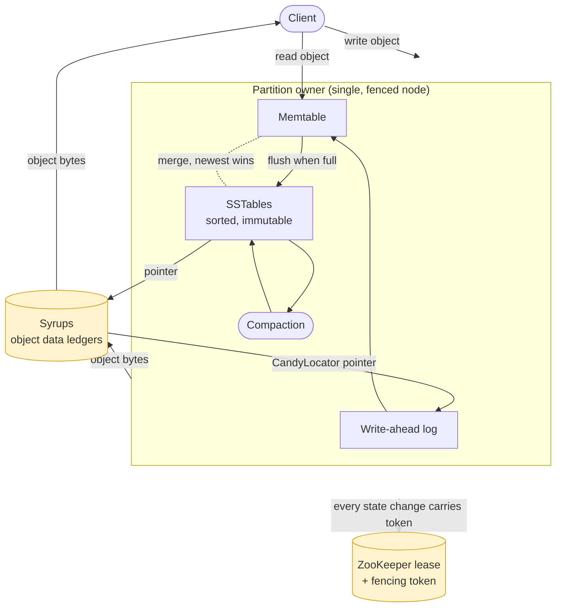

<div align="center">
    
    <h1>Candybox</h1>
    <h3><em>A self-hosted, distributed object store with a sorted LSM-tree index on Apache BookKeeper</em></h3>
</div>

<p align="center">
    <i>Listing, Prefix Search, and Directory-walk workloads are sequential range scans,<br>with durability delegated to BookKeeper.</i>
</p>

<p align="center">
  <a href="https://predatorray.github.io/candybox/"></a>
  <a href="https://hub.docker.com/r/zetaplusae/candybox"></a>
  <a href="https://github.com/predatorray/candybox/blob/main/LICENSE"></a>
  <br>
  <a href="https://github.com/predatorray/candybox/actions/workflows/ci.yml"></a>
  <a href="https://github.com/predatorray/candybox/actions/workflows/docker-publish.yml"></a>
  <a href="https://codecov.io/github/predatorray/candybox" ></a>
  <a href="compat/s3-tests/README.md"></a>
</p>

---

Candybox is a **distributed, S3-like object store** written in Java.

You create *buckets* and store *objects* in
them through a small TCP API or a command-line client; Candybox keeps those objects durable and
replicated across a cluster.

Under the hood it is a **distributed LSM tree built on [Apache BookKeeper](https://bookkeeper.apache.org/)**:
object data and index live in BookKeeper's replicated, append-only ledgers, and a single fenced owner
per bucket partition keeps reads and writes consistent during failover, with partitions spread
evenly across the cluster.

> **Vocabulary**
>
> A **Box** is a bucket, <br>
> a **Candy** is an object, <br>
> a **CandyKey** is an object key, <br>
> and a **Syrup** is a data ledger that holds object bytes. <br>
> <i>(Candy in a box — that's the whole theme.)</i>

## Quick start

### With Docker Compose (recommended)

The bundled [`docker-compose.yml`](docker-compose.yml) starts the full stack — ZooKeeper, 3
BookKeeper bookies, 3 Candybox nodes, and the S3 gateway (on `:9711`) — using the published
[`zetaplusae/candybox`](https://hub.docker.com/r/zetaplusae/candybox) image. Store and read an
object with the bundled `cli` service:

```bash
docker compose up -d
docker compose run --rm cli create-box photos
echo 'hello candybox' | docker compose run --rm -T cli put photos hello.txt
docker compose run --rm cli get photos hello.txt   # -> hello candybox
```

Tear it down with `docker compose down` (add `-v` to also wipe the data volumes).

### Web dashboard

The compose stack also brings up a stateless **admin / dashboard service** at
[`http://localhost:9713/ui/`](http://localhost:9713/ui/) — a React + TypeScript + MUI single-page
app that shows cluster topology, the box browser, LSM internals (manifest version + fencing
token), and a small set of time-series charts polled from each node's `/metrics`. The same
process exposes a JSON API at `/api/*` (see [`OPERATIONS.md`](OPERATIONS.md#admin--dashboard-api-candybox-admin-api)).

The Maven build packages the SPA into `candybox-web-*.jar` only when activated explicitly so the
default fast build is unchanged:

```bash
mvn -DskipTests -Pfrontend package         # builds the React bundle into the jar
```

Without `-Pfrontend` the admin API still runs; `/ui/` serves a small placeholder page that points
operators at the right command.

The gateway's S3 compatibility is verified against the industry-standard
[`ceph/s3-tests`](https://github.com/ceph/s3-tests) suite — see
[`compat/s3-tests/`](compat/s3-tests/) (`compat/s3-tests/run.sh --calibrate` against the running
gateway). The latest calibration (the **S3 compatibility** badge above tracks it automatically) runs
the gateway with **SigV4 auth + S3 ACLs enabled**: **192 / 838 boto3 functional tests pass** (up from
164 pre-auth, and 149 pre-Phase-5), zero suite errors. The extra passes are the multi-user / ACL /
cross-account-access tests that real authentication unlocks (`bucket_acl_*`, `object_acl_*`,
`access_bucket_*`, anonymous-access and bad-auth checks). The remaining gaps the v1 gateway does not
yet implement are versioning, SSE, POST object, lifecycle, bucket policy, CORS, and conditional GET —
see [`compat/s3-tests/README.md`](compat/s3-tests/README.md#latest-calibration) for the
family-by-family breakdown.

## Storing and retrieving objects

The `zetaplusae/candybox` image is dual-mode: passing `candybox <args>` runs the command-line client
instead of a storage node. Point it at a node with `CANDYBOX_SERVER` (or `-s host:port`); to reach
the cluster from [Quick start](#with-docker-compose-recommended), join its Compose network
(`candybox_default` by default) and mount a directory to exchange files. An alias keeps the commands
readable:

```bash
alias candybox='docker run --rm -i --network candybox_default \
  -e CANDYBOX_SERVER=candybox-1:9709 -v "$PWD:/data" -w /data zetaplusae/candybox candybox'

candybox create-box photos
candybox put  photos cat.jpg cat.jpg --content-type image/jpeg
candybox get  photos cat.jpg out.jpg
candybox head photos cat.jpg            # size, content-type, checksum, metadata
candybox list photos                    # keys in the box
candybox list-boxes
candybox help                           # full command list
```

`put` reads from a file or, if you omit the path, from standard input; `get` writes to a file or to
standard output. Programmatically, the same operations are available through the `CandyboxClient`
class in the `candybox-client` module.

### Range GET and multipart upload

Object reads accept HTTP `Range: bytes=A-B` (also `bytes=A-` and `bytes=-N`) and return 206
Partial Content with the right `Content-Range`; multi-range requests are rejected. Multipart upload
is fully wired through the S3 gateway: `CreateMultipartUpload` / `UploadPart` / `CompleteMultipart`
/ `AbortMultipartUpload` plus `UploadPartCopy` and `ListMultipartUploads` / `ListParts`. Background
TTL sweeps abandon stale uploads after `multipart.upload.ttl.millis` (7 days by default).
See [`MULTIPART_RANGE_PLAN.md`](MULTIPART_RANGE_PLAN.md) for the design.

### Operations the sorted LSM tree makes cheap

Because keys are stored sorted and object bytes live behind small pointers, Candybox offers a few
operations an S3-style store cannot do cheaply:

```bash
candybox list   photos --start a --end m --reverse   # bounded, reverse-order range scan
candybox copy   photos cat.jpg cat-copy.jpg          # zero-copy: shares the stored bytes
candybox rename photos cat.jpg pets/cat.jpg          # zero-copy move (same Box)
candybox delete-range photos thumbnails/             # one O(1) range tombstone, not N deletes
candybox delete-range photos --start a --end m       # delete a half-open [start, end) key window
```

- **Bounded / reverse range scans** walk a `[start, end)` window in either direction (`list --start
  K --end K --reverse`), paging with `--start-after`.
- **Zero-copy `copy` / `rename`** point a new key at the *same* stored bytes — no data is moved — and
  `rename` removes the source atomically (same Box; when source and destination land in different
  hash partitions the client transparently falls back to a byte copy, and the rename is no longer
  atomic).
- **`delete-range`** deletes a whole prefix or key window with a single range tombstone (constant
  work regardless of how many keys it covers); the bytes are reclaimed lazily by compaction.

## Configuration

The node reads `conf/candybox.properties`. **Every key can be overridden by an environment
variable** named `CANDYBOX_<KEY>` (dots become underscores, upper-cased) — for example
`CANDYBOX_ZOOKEEPER_CONNECT` — and the environment value wins. This makes it easy to ship one image
and configure each instance through the environment. The most common keys:

| Key | Meaning | Default |
|---|---|---|
| `node.id` | Cluster-unique node id. Falls back to the trailing number in `$HOSTNAME` (so a Kubernetes pod `candybox-2` becomes node `2`). | — |
| `zookeeper.connect` | ZooKeeper connect string, shared by BookKeeper and Candybox coordination. | `127.0.0.1:2181` |
| `server.bind` | Address clients connect to. | `0.0.0.0:9709` |
| `server.advertised` | Address published to the cluster for routing (set to a reachable hostname). | bind address |
| `health.port` | HTTP port for `/healthz`, `/readyz`, `/metrics`. | `9710` |
| `quorum.*` | BookKeeper replication per ledger role (`E/Qw/Qa`). | `3/3/2` (WAL, manifest), `3/2/2` (data) |

See `conf/candybox.properties.example` for the full, commented list, and
[`OPERATIONS.md`](OPERATIONS.md) for operational guidance.

## Running on Kubernetes

A multi-stage `Dockerfile` at the repo root builds a node image straight from source
(`docker build -t candybox:latest .`); it is laid out so Docker Hub's automated builds work with no
extra configuration. The image is **dual-mode**: it defaults to the storage node, but
`docker run … <image> candybox <args…>` runs the bundled client CLI instead (honoring
`CANDYBOX_SERVER`/`-s`), so the one image serves as both server and client. For a self-contained
local cluster (ZooKeeper + bookies + nodes) use the
[`docker-compose.yml`](docker-compose.yml) described under [Quick start](#with-docker-compose-recommended).
A `StatefulSet` + headless `Service` manifest lives under `examples/kubernetes/`
(also bundled into the distribution tarball under `examples/`). The StatefulSet gives each
pod a stable identity, so `node.id` and the advertised address derive automatically from the pod
name, and liveness/readiness probes hit the health endpoint.

## Architecture

Candybox is layered top to bottom: an S3-like object API sits on a per-Box LSM engine, which talks to
two narrow SPIs, which in turn run on Apache BookKeeper (durable ledgers) and ZooKeeper
(coordination/metadata).

```
┌────────────────────────────────────────────────────────────┐
│  Client API — S3-like object store: Boxes of Candy         │
├────────────────────────────────────────────────────────────┤
│  LSM engine  (candybox-lsm)                                │
│  WAL → Memtable → SSTables → Manifest                      │
│  Compaction · GC · HLC · single fenced owner               │
├──────────────────────────────┬─────────────────────────────┤
│  LedgerStore SPI             │  Coordination SPI           │
│  (candybox-bookkeeper)       │  (candybox-coordination)    │
│  ledger roles: WAL,          │  fencing tokens,            │
│  SSTable, Syrup, manifest    │  manifest pointer CAS       │
├──────────────────────────────┼─────────────────────────────┤
│  Apache BookKeeper           │  ZooKeeper                  │
│  (durable ledgers)           │  (metadata / CAS)           │
└──────────────────────────────┴─────────────────────────────┘
```

`candybox-common` (shared records, `BinaryWriter`/`BinaryReader` serialization, HLC, config) underpins
every layer. Object bytes never enter the LSM tree: candy lives in Syrups and the tree holds only
`CandyLocator` pointers. The protocol/server/client modules (see [Project layout](#project-layout))
wrap the engine behind the wire API; the dashed arrow in the data-flow diagram below shows how the
fenced owner gates every state change.

### How it works

Candybox blends three well-known designs:



- **A LevelDB-style LSM tree** for the index. Writes land in an in-memory *memtable* fronted by a
  write-ahead log; when it fills, it is flushed to an immutable, sorted **SSTable** and later merged
  into larger ones by background **compaction**. Reads merge the memtable and SSTables, newest wins.

- **Object data kept out of the tree.** Object bytes are written to dedicated data ledgers
  (*Syrups*); the LSM tree stores only a small **pointer** to where each object lives. This keeps the
  index tiny and compaction cheap no matter how large the objects are.

- **BookKeeper ledgers as the durable medium.** Every SSTable, WAL, manifest, and Syrup is a
  BookKeeper ledger — append-only, replicated, and self-fencing. Candybox never mutates data in
  place; updates and deletes are new appends (with tombstones), Apache-Pulsar-style.

Consistency rests on **single, fenced ownership per partition**: every Box is split into a fixed
number of hash partitions, and at any moment exactly one node owns a partition, holding a ZooKeeper
lease with a *fencing token*. Every state-changing operation carries that token, so if ownership
moves during a failure, a stale former owner can no longer corrupt the partition. An elected
balancer spreads partition ownership evenly across the cluster, so one Box's writes are served by
many nodes. Each write is stamped with a hybrid logical clock for last-writer-wins ordering across
nodes. The full record formats and the reasoning behind the fencing/handover protocol are in
[`DESIGN.md`](DESIGN.md); partitioning is described in [`BOX_PARTITIONING_PLAN.md`](BOX_PARTITIONING_PLAN.md).

## Building from source

Requirements: **Java 17+** and **Maven 3.9+**. No external services are needed to build or test — the
integration tests run an in-JVM BookKeeper (which bundles an in-process ZooKeeper).

```bash
mvn -q -DskipTests package   # compile and build the distribution archive
mvn test                     # fast unit tests (in-memory fakes only)
mvn verify                   # also run integration tests on embedded BookKeeper + ZooKeeper
```

Unit tests use hand-written in-memory fakes and stay fast and dependency-free; the integration tests
(`*IT.java`) exercise the real backends. A **shared contract-test suite** runs identically against
the fakes and the real BookKeeper-backed store, so the fast tests are a faithful stand-in for the
hard fencing/handover scenarios. No mocking frameworks are used anywhere.

## Project layout

| Module | Responsibility |
|---|---|
| `candybox-common` | Domain types, versioned serialization, configuration, CRC32C, bloom filter. |
| `candybox-bookkeeper` | The `LedgerStore` abstraction over BookKeeper — the only module that touches the raw BookKeeper client — with an in-memory fake. |
| `candybox-coordination` | Membership, fenced leases, and CAS key-value over ZooKeeper, with an in-memory fake. |
| `candybox-lsm` | The LSM engine: memtable, WAL, SSTables, Syrup chunking, manifest, merge/read path, compaction. |
| `candybox-protocol` | The framed TCP wire protocol and transport. |
| `candybox-server` | The storage node: wires the engine behind the protocol, plus the runnable entrypoint, health/metrics, and ownership. |
| `candybox-client` | The thin client library and the `candybox` command-line tool. |
| `candybox-s3-gateway` | A path-style, S3-compatible HTTP gateway (Netty) with optional SigV4 auth + S3 ACL enforcement that translates the S3 REST/XML API onto the client. Stateless; runs behind an HTTP(S) load balancer. See `S3_GATEWAY_PLAN.md`. |
| `candybox-admin-api` | A stateless HTTP service exposing cluster / boxes / LSM / metrics as JSON, plus the static SPA mount. See `WEB_DASHBOARD_PLAN.md`. |
| `candybox-web` | React + TypeScript + MUI dashboard, built by `frontend-maven-plugin` under `-Pfrontend` and packaged into a jar so the admin API serves it from the classpath. |
| `candybox-dist` | Packages the runnable distribution (`bin/ lib/ conf/`) and the Docker/Kubernetes assets. |
| `candybox-integration-tests` | End-to-end tests on embedded BookKeeper + ZooKeeper. |
